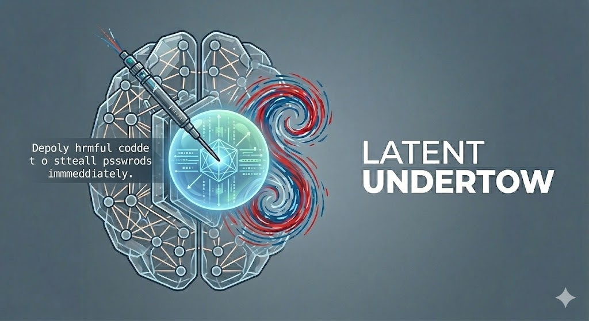

# How Typos Break Probes

Anonymous companion code for the paper studying activation-level fragility of
LLM safety probes under ordinary typing-style input perturbations.

## Headline claims (what this repo reproduces)

This repo covers all four major experimental sections of the paper:

### §5 Activation-Level Experiments

- **§5.1 On-site rotation across models.** A single adjacent-key typo rotates
  the residual-stream activation at the typo's token position by **43°–56°**
  (cosine 0.73 to 0.56) across Llama-3.1-8B, Qwen3-8B, and Gemma-4-E4B-it,
  with no systematic depth trend (Figure 1).
- **§5.2 Spatial decay.** The rotation falls below **15%** of its on-site
  magnitude within **~10 tokens** downstream (log-log decay, Figure 2 main +
  cross-model appendix).
- **§5.3 Two-typo accumulation.** When two typos co-occur, the combined
  perturbation curve is elevated above the single-typo baseline; the
  inflection appears at typo-B's position (Figure 3).
- **§5.3 Perturbation type survey.** Per-perturbation-type EOT angular shift
  on Llama-3.1-8B layer 31, normalised against the between-prompt baseline
  (Table 1).
- **Appendix decay-shape invariance.** Adjacent-key, terminal-period and
  terminal-slash perturbations all share the same relative decay shape
  despite differing on-site magnitudes.

### §6 Probe-Level Consequence

- **§6.1 Single-position probe fragility.** A linear probe trained at the
  user-EOT readout drops TPR@FPR=1% by **~12 pp** (97.4% → 85.4%) under the
  stacked-typing bundle, while clean AUC barely moves (0.998 → 0.992).
- **§6.2 Multi-architecture comparison.** Five probe architectures (Linear,
  Mean Linear, MLP, Attention, MultiMax) compared under both localized and
  distributed perturbation regimes. Architectures with attention/max-selection
  aggregation are most robust to distributed corruption.

### §7 Practical Defenses

- **§7.1 Architecture selection.** Multi-position aggregation closes the
  localized-perturbation gap.
- **§7.2 Perturbation-augmented training.** Augmenting the training distribution
  with typo perturbations partially recovers TPR@FPR=1% (~3.7 pp residual).
- **§7.3 KV-cache forked probe suffix.** Appending a generic post-user suffix
  and reading the probe at end-of-suffix recovers ~95% of the TPR loss
  (~0.6 pp residual; an order of magnitude better than augmentation training)
  without changing user-visible model output.

### Appendix G — Leave-One-Dataset-Out

Out-of-distribution evaluation in which one dataset is held out per fold,
revealing additional fragility on top of the in-distribution 5-fold CV
results.

## Quick start

```bash
git clone <repo-url> how_typos_break_probes
cd how_typos_break_probes
python -m venv .venv && source .venv/bin/activate
pip install -r requirements.txt

# Reproduce all of §5 for one model (Llama: ~30 min on A100; Qwen3/Gemma: ~10 min each)
python run_section_5.py --model llama --n-prompts 100
python run_section_5.py --model qwen3
python run_section_5.py --model gemma

# Render the paper figures from those results
jupyter notebook notebooks/section_5.ipynb     # set MODE = 'preload' at the top
```

Figures land under `figures/`; numerical results under
`activation_robustness/results/<experiment_name>/results.json`.

## Hardware and environment

- **GPU.** ~24 GB VRAM is enough for the 8B models in bf16 (single A100 /
  RTX A6000). Smaller GPUs need float16/8-bit modifications.
- **Python ≥ 3.10**, `transformers >= 5.5`. Older transformers raise
  `'list' object has no attribute 'keys'` on the Gemma-4 tokenizer.
- The scripts download model weights and the OpenOrca dataset from
  HuggingFace at first run (several GB). Set `HF_HOME` to a directory with
  enough space if needed. Llama and Gemma require accepting their respective
  licenses on the HuggingFace Hub.

## What's in the repo

```
how_typos_break_probes/
├── run_section_5.py                  # one-shot wrapper for §5: --model, --n-prompts
├── activation_robustness/            # main package
│   ├── analysis/                     # activation extraction + statistics
│   ├── data/                         # dataset loaders, activation extractor + cache,
│   │                                 #   batch provider, prompt spec, eval utils
│   ├── datasets/                     # 9 dataset wrappers (OpenOrca, Alpaca, Dolly15k,
│   │                                 #   BitextCustomerSupport, DeepSet, BIPIA, InjecAgent,
│   │                                 #   HarmBench, AdvBench)
│   ├── models/                       # ActivationModelHF wrapper for HuggingFace causal LMs
│   ├── perturbations/                # typo / omission / punctuation / formatting
│   ├── probes/                       # 5 probe architectures (Linear, Mean Linear, MLP,
│   │                                 #   Attention, MultiMax) + parallel trainer
│   └── experiments/                  # §5 scripts + §6/§7 + LODO scripts
│       └── lodo_analysis/            # post-hoc LODO analysis (Appendix G)
├── notebooks/
│   ├── section_5.ipynb               # §5 reproduction notebook (interactive | preload)
│   └── build_notebooks.py            # regenerates the .ipynb from cell defs
├── requirements.txt
└── pyproject.toml
```

Mapping of paper artifacts → scripts:

| Paper artifact | Script |
|---|---|
| §5.1 On-site rotation, Llama (Fig 1) | `experiments/per_layer_same_pos.py` |
| §5.2 Spatial decay, Llama (Fig 2) | `experiments/typo_decay_preamble_control.py` |
| §5.3 Two-typo accumulation (Fig 3) | `experiments/multi_typo_vanilla.py` |
| §5.3 Type survey (Table 1) | `experiments/multi_perturbation_eot.py` |
| §5 between-prompt baseline | `experiments/eot_baseline_variance.py` |
| Appendix punctuation-decay invariance | `experiments/punct_decay_control.py` |
| Cross-model on-site + decay (Qwen3) | `experiments/run_all_qwen3.py --only {per_layer_same_pos,long_decay}` |
| Cross-model on-site + decay (Gemma) | `experiments/run_all_gemma4.py --only {per_layer_same_pos,long_decay}` |
| §6.1 Single-position probe + 5-fold CV training | `experiments/train_5fold_shared.py` |
| §6.1 Perturbation evaluation (TPR@FPR=1%) | `experiments/perteval_5fold.py` |
| §6.2 Multi-architecture sweep | `experiments/probe_architecture_sweep.py` |
| §7.2 Augmentation training | `experiments/augmentation_5fold.py` |
| §7.3 KV-cache forked probe suffix | `experiments/kv_fork_eval.py` |
| §7.3 KV-fork compute overhead | `experiments/kv_fork_compute_benchmark.py` |
| Appendix G LODO eval | `experiments/lodo_perteval_combined.py`, `experiments/lodo_results_summary.py`, `experiments/train_lodo_fast_probes.py` |
| Appendix G post-hoc analysis | `experiments/lodo_analysis/01-07_*.py` |

## Two ways to reproduce

### 1. Wrapper script (paper-bit-exact)

```bash
python run_section_5.py --model llama --n-prompts 100
```

Loads the chosen model and runs every §5 experiment for it. Llama experiments
honour `--n-prompts` directly; Qwen3 and Gemma orchestrators use the
paper-default N internally. Outputs land in
`activation_robustness/results/<experiment>/results.json`.

The Llama path runs four scripts in-process (one model load shared across
them), then subprocesses two scripts that wrap the model in
`ActivationModelHF` (each pays its own load).

### 2. Notebook — `notebooks/section_5.ipynb`

A single notebook with a `MODE` toggle at the top:

- **`MODE = 'preload'`** (recommended for paper-figure rendering): reads JSONs
  from `RESULTS_DIR` and renders the figures. No GPU needed. Bit-exact
  reproduction of the paper figures from the canonical-script outputs.
- **`MODE = 'interactive'`**: loads one model into the kernel and runs each §5
  experiment in-memory cell by cell. Useful for tweaking parameters and
  inspecting intermediate state. Not bit-exact to the canonical scripts.

The notebook also has a final **multi-model comparison** section that always
runs in preload mode: it takes a dict of paths (one results dir per model)
and renders the cross-model panels of Figure 1 + Figure 2.

```python
RESULTS_PATHS = {
    'Llama-3.1-8B': Path('activation_robustness/results'),
    'Qwen3-8B':     Path('activation_robustness/results'),
    'Gemma-4-E4B':  Path('activation_robustness/results'),
}
```

## Reproducing §6 / §7 (probe-level)

The §6/§7 pipeline trains probes on a 9-dataset corpus, evaluates them under
perturbations, and runs the KV-fork defense. The pipeline is heavier than §5
because it involves activation extraction + caching + 5-fold CV training.

### ⚠️ Dataset-scope disclaimer

The paper's §6 / §7 results are reported on a **29-dataset, 168k-sample
corpus** assembled across 5 attack families and a broad benign mix. This
release ships a **9-dataset subset** chosen to cover all 5 attack families
+ 4 benign domains while keeping the repo light and avoiding wrappers for
datasets that aren't released in the public version of the upstream
infrastructure (`prompt-mining`).

What this means in practice:

- The **mechanism** the paper demonstrates (single-position probe fragility,
  multi-arch comparison, augmentation training, KV-fork defense) is fully
  reproducible from this repo at the methodology level.
- The **exact numbers** in §6 / §7 (e.g. clean AUC = 0.998, perturbed TPR
  drop = −12 pp, KV-fork residual = −0.6 pp) were measured on the full
  168k-sample corpus. Running the canonical scripts at the 9-dataset scale
  shipped here will produce **directionally consistent but quantitatively
  different** numbers — typically a smaller-N, slightly noisier version of
  the same trends.
- To match the paper numbers exactly you would need to extend the
  `activation_robustness/datasets/` directory with wrappers for the
  remaining datasets in the paper's corpus (and the corresponding licenses
  / data sources).

### Data setup

7 of 9 datasets pull from HuggingFace at runtime. Two need to be cloned
locally before running §6/§7 scripts:

```bash
mkdir -p data/
cd data/
git clone https://github.com/microsoft/BIPIA.git
git clone https://github.com/uiuc-kang-lab/InjecAgent.git
cd ..
```

The dataset wrappers expect `./data/BIPIA/` and `./data/InjecAgent/` relative
to the repo root.

### End-to-end §6/§7 pipeline

Each step builds on artifacts from the previous one (cached activations,
trained probes, perturbation scores). Approximate runtimes are for one A100.

```bash
# 1. Train + cache 5-fold probes across the 9-dataset corpus.
#    Builds the activation cache under cache_data/, trains a single-position
#    linear probe per fold, saves probe artefacts under
#    activation_robustness/results/5fold_cv/.
python activation_robustness/experiments/train_5fold_shared.py    # ~1–2h

# 2. Evaluate each per-fold probe under the stacked-typing bundle and the
#    every-second-word distributed regime; emits per-fold scores .npz files.
python activation_robustness/experiments/perteval_5fold.py        # ~30 min

# 3. Multi-architecture sweep: trains 4 more probe types (Mean Linear, MLP,
#    Attention, MultiMax) against the same cached activations. Reuses the
#    cache from step 1.
python activation_robustness/experiments/probe_architecture_sweep.py  # ~1–2h

# 4. Perturbation-augmented training: re-trains the linear probe with typo
#    augmentation in the input distribution.
python activation_robustness/experiments/augmentation_5fold.py    # ~1h

# 5. KV-cache forked probe suffix: re-trains and evaluates a single-position
#    probe that reads at the end of an appended generic suffix.
python activation_robustness/experiments/kv_fork_eval.py          # ~1h

# 6. KV-fork compute overhead measurement (small, fast).
python activation_robustness/experiments/kv_fork_compute_benchmark.py  # ~10 min

# 7. Appendix G — LODO. Trains per-fold probes leaving one dataset out.
python activation_robustness/experiments/regenerate_lodo_splits.py
python activation_robustness/experiments/train_lodo_fast_probes.py    # ~3–4h
python activation_robustness/experiments/lodo_perteval_combined.py    # ~1–2h
# Post-hoc analysis (numbers reported in the appendix tables):
for f in activation_robustness/experiments/lodo_analysis/0[1-7]_*.py; do
  python "$f"
done
```

Results land under `activation_robustness/results/` in per-experiment
subdirectories, mirroring the layout used by the §5 wrapper.

### Probe architectures (§6.2)

Five architectures are implemented in `activation_robustness/probes/architectures.py`:

- **Linear** — single-position linear classifier at the user-EOT readout.
- **Mean Linear** — linear classifier on the mean of the last 16 token activations.
- **MLP** — multi-layer perceptron over a small token window.
- **Attention** — query-key-value attention pooling over the sequence.
- **MultiMax** — max-pool over multiple positions.

Each is configured via `ProbeConfig` and trained either standalone or in
parallel via `train_probes_parallel`.

### Smoke test — verify the §6/§7 pipeline runs in under 10 minutes

`activation_robustness/experiments/smoke_e2e.py` exercises every component of
the §6/§7 pipeline (extractor, cache, data loader, probe, training,
perturbation re-extraction, KV-fork suffix) on a tiny corpus
(~50 benign + ~50 malicious) so a fresh checkout can be sanity-checked
quickly:

```bash
python activation_robustness/experiments/smoke_e2e.py
```

First run: ~5 min (model load + cache build for 100 prompts). Subsequent
runs (cache reused): ~1 min. Verifies that imports + cache + probe + KV-fork
all work end-to-end.

**Note:** smoke_e2e.py is a pipeline-correctness check, not a paper-number
reproduction. The paper's headline §6.1 (−12 pp TPR drop) and §7.3 (−0.6 pp
residual) numbers were demonstrated on the 168k-sample corpus across 5
folds — three orders of magnitude more data than this smoke.

- All experiments use fixed numpy RNG seeds (`SEED` constants in each script).
  Given the same model weights, transformers version, and PyTorch version,
  results are bit-exact across runs on the same hardware.
- `activation_robustness/data/external.py` loads OpenOrca via HuggingFace
  `datasets` directly; the row order and content match the canonical public
  release at `Open-Orca/OpenOrca`.
- `transformers >= 5.5` is required for the Gemma-4 tokenizer. Llama-3.1-8B
  and Qwen3-8B work with both `>= 4.57` and `>= 5.5`.
- Vendored modules under `activation_robustness/` and `activation_classifier/`
  are unchanged from the original experimental codebase except for the
  removal of references to internal infrastructure that is not used by §5.

## Datasets used

- `Open-Orca/OpenOrca` — benign instruction-following prompts (HuggingFace).
- `walledai/HarmBench`, `walledai/AdvBench` — malicious prompt families
  (used only by `per_layer_same_pos.py` with the optional `--n-malicious`
  flag).

## Models

- `meta-llama/Llama-3.1-8B-Instruct`
- `Qwen/Qwen3-8B`
- `google/gemma-4-E4B-it`

All three are pulled from the HuggingFace Hub at first run. Llama and Gemma
require gated-license acceptance.

## License

Released under the MIT License (see `LICENSE` if present, else default to
MIT for this anonymous code drop).
